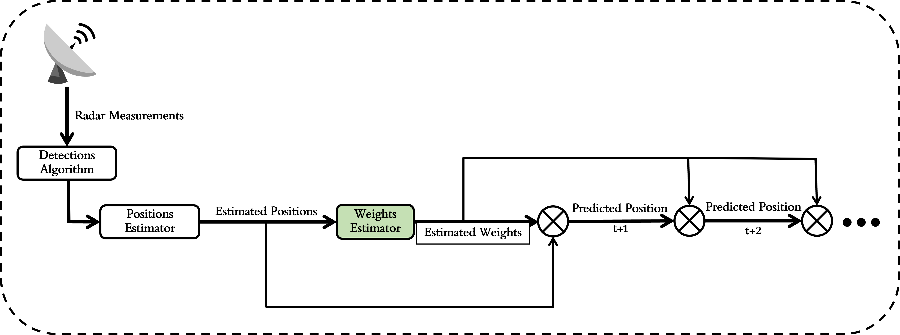
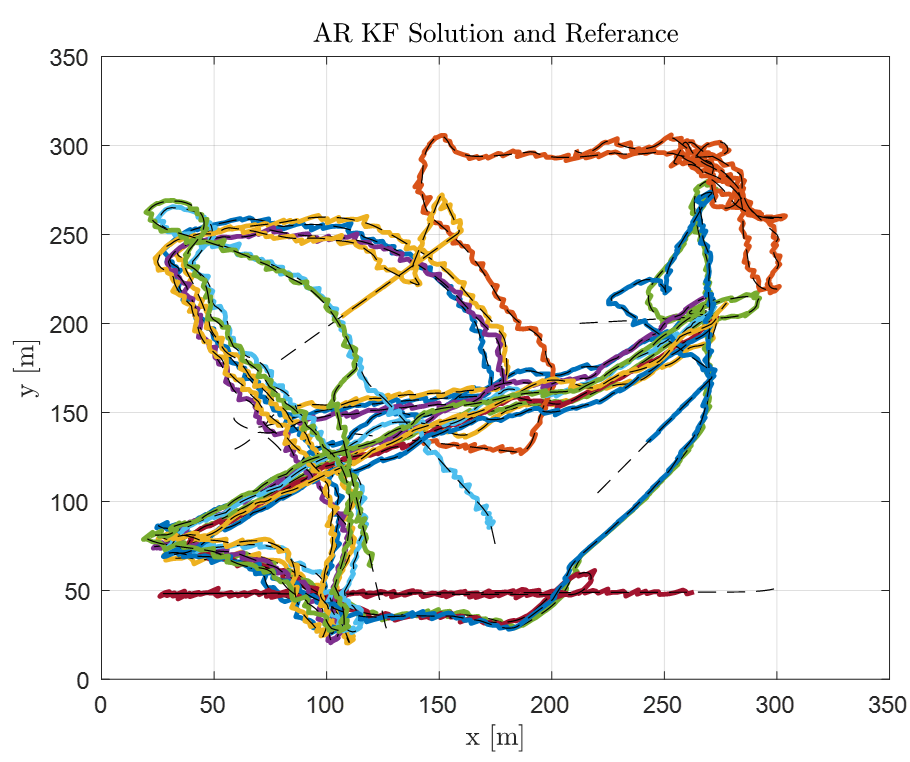
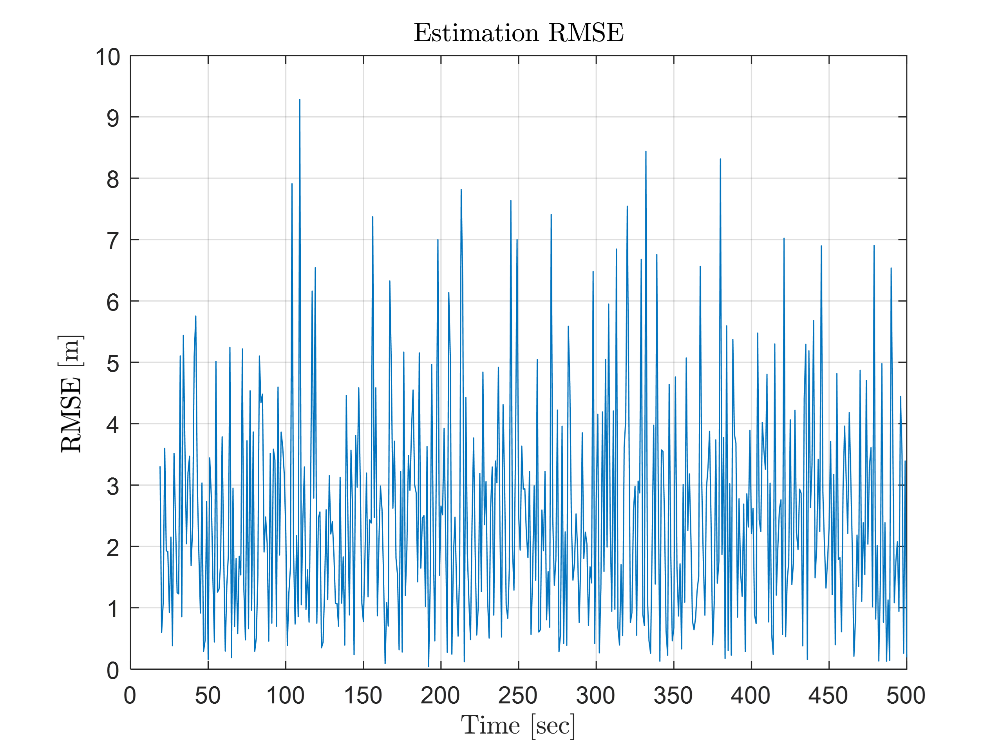
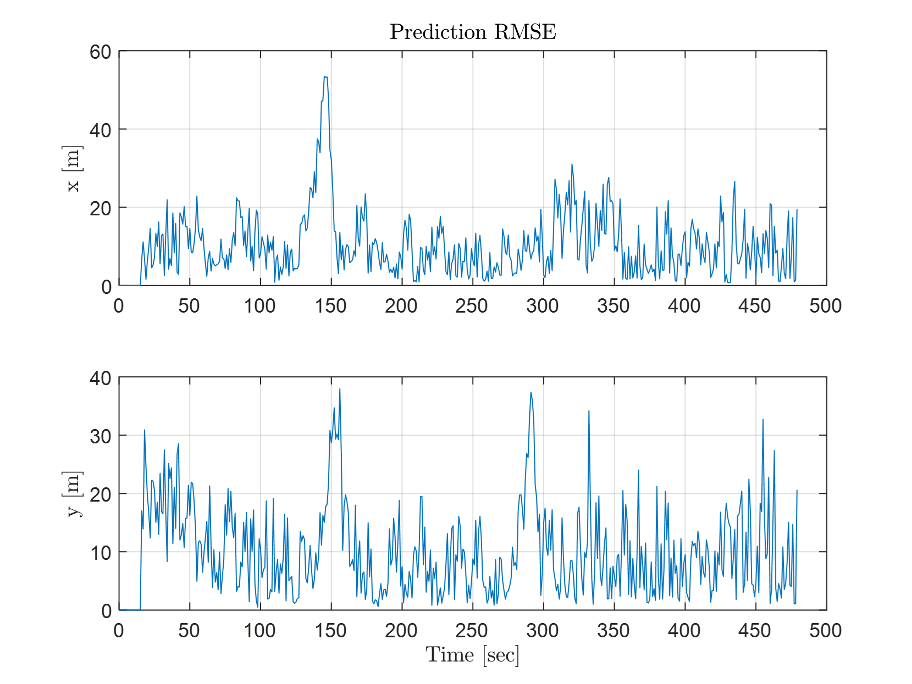
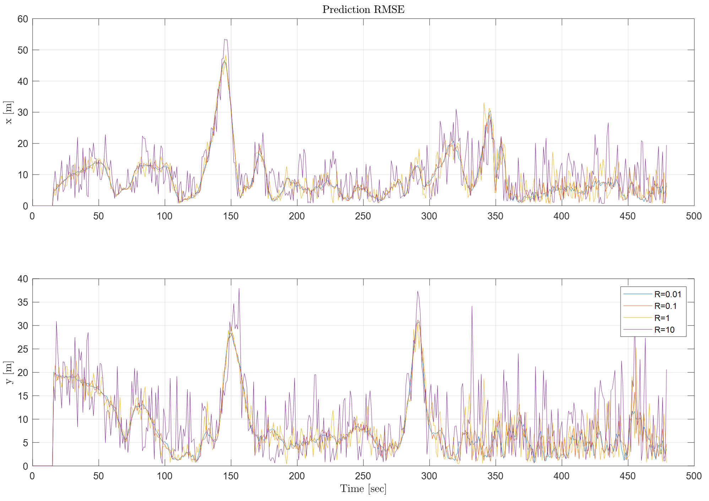

B.SC. FINAL PROJECT 1

Multiple Target Tracking: Revealing Causal

Interactions in Complex Systems

Yehonatan Dahan, *Ben-Gurion University*

***Abstract*---Revealing the underlying interaction in an observed
physical system is a long-time challenge tackled by many \[1\].
Recently, some attempts were made to mathematically define the causality
in physical systems. This work suggests estimating the forecasted states
of detected objects using a mathematical time series models and methods,
together with a two-layer estimation algorithm: one for the targets'
location and another for the dependence of their trajectories. Some
theoretical basis will be introduced followed by a simulation of
artificially generated bird flocking movement. Some results will be
shown together with conclusions.**

***Index Terms*---Multiple Target Tracking, Granger Causality, Kalman
Filter, Radar Systems**

I. INTRODUCTION

**T** lenge in this field is real-time multi object tracking and years
both in research and development. A major chal-HE field of Radar Systems
has advanced over the last

trajectory forecasting. Real time objects tracking is the process of
determining the position of moving objects over time using some
measurement and sensors in real time driven data. Trajectory forecasting
refers to the prediction of the described objects' future positions. One
of the challenges when tracking objects is interpreting a noisy
measurement, and understanding it comprehensively. We wish to focus on a
noisy Radar Detection of multiple objects.

This work's goal is to develop and implement a tracking algorithm that
is able to detect surrounding objects, classify them, estimate their
dynamics, and model their movement to forecast their trajectories. The
immediate goal is to treat the objects' trajectories as an
auto-regression time series and estimate the model's weights by using
positions of detected objects as a measurement in an estimation
algorithm. Using a Kalman Filter (KF) algorithm, we intend to estimate
the position of the objects in the environment by using the Radar System
as a position measurement for each object.

The problem arises when the objects interact or influence each other,
and the individual dynamics model for each object does not hold.
Moreover, each object's forecasted trajectory is time dependent, as new
measurements are obtained through the sensors (which also include
internal measurement noise). Objects may also hide one another from the
perspective of the Radar and moving objects could unite into one object
or split into two, making it even harder to track each and every
detected object. Thus, forecasting the expected trajectory of the
detected objects is a great challenge as all the factors above lead to
an expanding uncertainty along forecasted the trajectory.

> *A. Objects' Influenced Trajectories*
>
> In addition to the difficulties of analyzing a noisy en-vironment, the
> forecasted trajectory of the objects may be influenced by other
> objects -- an influence that may vary with time and be treated as a
> time series. Specifically, one object's movement may be influenced by
> its' neighbor objects and vise versa -- an influence that changes with
> the change of the objects' positions.
>
> *B. Granger Causality*
>
> Another field that also struggles with estimating the influ-ence of
> one time series on another is the field of Economics. For that
> purpose, the Granger causality test was developed in 1969 by Clive
> Granger. The Granger causality test is a statistical hypothesis test
> for determining whether one (or more) time series information is
> useful in forecasting another time series. Therefore, a detected
> objects' trajectory can be modelled as an autoregressive (AR) time
> series and by using the Granger causality test, the influence of one
> object's fore-casted trajectory on the other objects' forecasted
> trajectories could be estimated.
>
> *C. Project's Suggestion*
>
> This project suggests estimating the forecasted states of objects
> detected by Radar System, using a mathematical time series models and
> methods, together with a two-layer estimation algorithm: one for the
> targets' location and another for the correlation between their
> trajectories.
>
> *D. Essential Conclusions*
>
> Some main conclusions of this work are that the weight estimation and
> prediction algorithm (presented in this work) lead to reasonably good
> trajectory prediction results. Together with that, it is the slowest
> thread in the flow between the sen-sors and the prediction solution,
> thus using a fully generalized AR model could only be relevant to low
> dimensional problems (in the case where the algorithm has to run in
> real time). The measurement noise passed to the weight's estimation
> algorithm by the position estimation influences its prediction
> abilities, leading to a noisy RMSE -- but the algorithm still leads to
> good results in the sense of RMSE.

II\. PROBLEM FORMULATION

> The object tracking and trajectory forecasting problem may be
> formulated as follows: Assume that at time *t* there are *nt*

B.SC. FINAL PROJECT 2

detected objects. Let **x**1:*t* = *x*1*, . . . , xt* represent the true
posi-tions of all *nt* detections and **z**1:*t* = *z*1*, . . . , zt* be
the positions measurement history up to time *t*. Each measurement *zi*
is a position of the object in cartesian co-ordinates, processed from

a Radar System measurement. We assume a dynamic model

**x***k* = *f*(**x***k−*1*, ϵk*) such that **x***k* = *Fk ·*
**x***k−*1 + *ϵk*, where *ϵk* is a zero mean random Gaussian variable.
We also assume the

measurement model **z***k* = *h*(**x***k, δk*) such that **z***k* =
**x***k* + *δk*, where *δk* is a zero mean random Gaussian variable. We
are concerned with estimating the expected position of all

detected objects, i.e., ˆ**x***t* = E\[**x***t\|***z**1:*t*\].
Furthermore, we aim to predict the objects' future trajectories, i.e.,
ˆ**x***t*+1:*t*+*p* = E\[**x***t*+1:*t*+*p\|*ˆ**x***t, z*1:*t*\] and
their influence on one another. For that purpose, we are concerned with
estimating the causality

of all *nt* detected objects on each object by estimating the
auto-regressive time series' last *n* weights, i.e., ˆ*αt* =
E\[*αt\|***x***t−n*:*t*\] for each of the detected objects.

> **Algorithm 1** Kalman Filter Algorithm
>
> *Set*(*Q, R*)
>
> ˆ**x***k−*1*\|k−*1 *←* **x0**\
> ˆ**P***k−*1*\|k−*1 *←* **P0 while** *True* **do**
>
> ˆ**x***k\|k−*1 *←* **Fkxk***−***1***\|***k***−***1**\
> ˆ**P***k\|k−*1 *←* **FkPk***−***1***\|***k***−***1FT if**
> *NewMeasurement* **then k**+ **Q**
>
> ˜**y***k ←* **zk** *−* **Hkˆxk***\|***k***−***1 Sk** *←*
> **HkPk***\|***k***−***1HT Kk** *←* **Pk***\|***k***−***1HT kS***−***1
> k**+ **R**
>
> ˆ**x***k\|k ←* ˆ**x***k\|k−*1 + **Kk˜yk**
>
> **else** ˆ**P***k\|k ←* (**I** *−* **KkHk**)**ˆPk***\|***k***−***1**
>
> ˆ**x***k\|k ←* ˆ**x***k\|k−*1
>
> **end if** ˆ**P***k\|k ←* ˆ**P***k\|k−*1
>
> III\. METHODOLOGIES **end while** *k −* 1 *← k*

The following section reviews some important methodolo-gies used along
this work, for example the Kalman Filter Gaussian Filter Estimator and
time series models such as the Autoregressive model and the Granger
Causality model.

*A. Kalman Filter Algorithm*

The Kalman filter is a mathematical recursive estimator that works by
using a series of predictions and measurements to update an estimate of
the system state \[2\]. It uses a process model to predict the state of
the system at the next time step, and then compares this prediction to
the actual measurement of the system state to compute the error between
the prediction and the measurement. The Kalman filter then uses this
error to update the estimation of the system state, considering the
uncertainty in both the prediction and the measurement. The Kalman
Filter is using the "moments parametrization"a technique for filtering
and prediction of linear Gaussian systems. This means, that at any time
t the prediction is represented by two parameters: a mean (*µn*) and a
covariance (Σ*n×norP*) of the predicted state. The KF algorithm is shown
in Algorithm 1.

*B. Autoregressive Model*

Analyzing the change over time of different sequentially recorded
parameters is referred to as time series analysis. Assuming the time
series is governed by a dynamical law, observations could be made to
study and reveal it. According to an autoregressive model, a future
state could be predicated using the past values in the series as they
are linearly correlated \[3\]. Assume that the current time state (that
is a part of a time series) *xt* is autocorrelated to its previous time
state *xt−*1. It follows thus, that the previous time state is highly
informative when trying to predict the current time state:

*xt* = *α*0 + *α*1*xt−*1 + *ϵt*

The previous state could not always solely determine the current state,
and thus the model above should be generalized

> to higher orders of AR. For example, using the *p*'s order of AR,
> denoted as AR(p) (assuming that p is a natural number), the current
> state would be \[4\]:

+-----------------+-----------------+-----------------+-----------------+
| *xt* = *α*0 +   | *p*\            | > *αixt−i* +    | \(1\)           |
|                 | �               | > *ϵt*          |                 |
+=================+=================+=================+=================+
+-----------------+-----------------+-----------------+-----------------+

> *C. Granger Causality Theorem*
>
> The AR model could be generalized to a multi variable time series, and
> together with the granger causality theorem \[5\], could represent the
> correlation of two or more time series on one another (their influence
> on one another) in the following manner: A time series granger-cause
> another time series if it"helps" predicting (forecasting) its next
> state. Suppose two different time series denoted as *x*(1) *t*\
> and *x*(2) *t*, each could be modeled using autoregression. *x*(1) *t*
> is said to "granger-cause" *x*(2) *t*, if the previous states of
> *x*(1) helps predicting or forecasting *x*(2) *t* next state. This key
> idea is demonstrated in the equation below, representing a bi-variate
> AR system:
>
> Note, that if *αk* 2 simplifies to two independent equations similar
> to equation*x*(1)
>
> *x*(2)\
> *t*
>
> *t*\
> = *α*(1)
>
> = *α*(2)\
> 0
>
> 0
>
> *i,j*= 0 for all *i*'s and for all *j ̸*= *k*, equation +�*p* +�*p
> i*=1*α*(1)
>
> *i*=1*α*(2)\
> 1*,ix*(1)
>
> 1*,ix*(1)\
> *t−i*+ �*p t−i*+ �*p*\
> *i*=1*α*(1)
>
> *i*=1*α*(2)\
> 2*,ix*(2)
>
> 2*,ix*(2)\
> *t−i*+ *ϵ*(1)
>
> *t−i*+ *ϵ*(2) (2)
>
> 1\. If this situation does not hold, i.e. The mutual coefficients are
> not all 0, that it is said that *x*(1) *t* is said to
> "granger-cause"*x*(2) *t* or vice versa.
>
> *D. Coefficients (Weights) Estimator*
>
> When generalizing equation 1 into N objects, of dimension D, with AR
> model of order k, the total number of weights could be calculated by
> using the following formula:
>
> \[*weights*\] = (*n · d · k*) *·* (*n · d*) = *k ·* (*n · d*)2 (3)

B.SC. FINAL PROJECT 3

{width="7.1402777777777775in"
height="2.3625in"}

Fig. 1. Block Diagram of the Weight estimator as part of the entire
System

In order to estimate the AR coefficients, this work focuses on using the
Bayesian estimation - and specifically the Kalman Filter. Once the
coefficients are estimated, prediction of the future states will be
possible, as shown in Fig 1. This way, prediction of the forecasted
trajectory of the detected object could be calculated "p" steps ahead --
by propagating the (estimated) position just by multiplying it by the
estimated weights. This way, the algorithm is also considering the
relations (influence) between those objects, as it is reflected in the
weights' values. The objects' dynamics (The change in its position
state) would be treated as a time series that is to be modelled using a
multivariate auto-regressive model, giving each time step its own weight
and allowing a representation of the causality of one object on another.
The model's weights would be estimated by using a Kalman Filter
estimation method, under the assumption that the Posterior could be
represented as a Gaussian. Formally, The Filter solves the problem of
estimating *α***t** i.e. finding the expected value
E\[*αt\|***x***t−n*:*t*\]. Another Kalman Filter position estimator will
be used directly to estimate the location of the detected objects, by
receiving a position measurement for each object from the Radar, and
treating it as point object tracking. Eventually, the objects'
forecasted trajectory will be derived using both the position estimator
and the estimated weights.

*E. State-Space Model*

Assuming the models shown in previous chapters, the suggested weights
Kalman Filter's state space equations are as follows: The estimated
state is made of the coefficients: ¯*αt*.

The state transition equation:

> ˙¯*α***t** = **f**(**¯***α***t**) + **vt** (4)

Whereas *f*(¯*αt*) = ¯**0** is the state transition function and *v ∼
N*(¯**0***, σ*2 the weights are considered as noise. Equation 4 could be
*v*) is the process noise. Equation 4 implies that

represented in the discrete form in the following way:

> ¯*αk*+1 = **I** *·* **¯***α***k** + **vk** (5)
>
> The measurement equation could be represented in the follow-ing
> manner:
>
> ¯**y***t* = *h*(¯*αt*) + *wt* (6)
>
> Where *h*(¯*αt*) is the measurement function which is based on the
> history of the position of the detected objects, and *w ∼ N*(¯**0***,
> σ*2 are independent of the location of the detected objects, and *w*)
> is the measurement noise. As the weights
>
> by using the linearity of the AR model, *h*(¯*αt*) could be
> represented as follows:
>
> *h*(¯*αt*) = **Ht** *·* **¯***α***t** (7)
>
> Note, that **Ht** = **blockdiag**(**¯x**(**1**) **t***−***1***, . . .
> ,* **¯x**(**1**) **t***−***K***, . . . ,* **¯x**(**N**) **t***−***K**)
> Where ¯**x**(*j*) *t−ti*is the position vector of the *j*'th object at
> time *t − ti*. Next, by receiving the estimated current position of
> the objects, the Kalman filter algorithm could be implemented to
> estimate the weights. Once having the estimated weights, the objects'
> positions could be propagated through time by simply multiplying them
> by the weights to predict their future location.

IV\. SIMULATION

> In order to test the algorithm, a simulation was created in MATLAB in
> the following manner: The simulation used a "flock" movement using a
> model called "Boids Model"\[6\] -- which is unknown to the estimation
> algorithm. The Boids model is a simulation of the movement of a flock
> of birds. It was developed by Craig Reynolds in 1986 as a way to
> simulate the seemingly chaotic movement of a flock of birds. The model
> is based on three simple rules: separation, alignment, and cohesion.
> The separation rule causes each bird to try to maintain a certain
> distance from its neighbors, the alignment rule causes each bird to
> try to match the velocity of its neighbors, and the cohesion rule
> causes each bird to try to move towards the center of mass of its
> neighbors. By following these simple rules, the movements of a flock
> of birds can be simulated in a realistic way. The Boids model has been
> used in many different fields, including computer vision, robotics, to
> study the behavior of flocks, schools, and swarms. The modelled output
> data according to the Boids model in 2D

B.SC. FINAL PROJECT 4

movement was used as ground truth to be compared to. This ground truth
was then noised with an AWGN to demonstrate a measurement noise.

In this tested simulation there was only use in the trajectories of the
flock i.e., the birds. There were N=10 boids, K=15 history timesteps,
P=20 predicting steps and D=2 is the dimensionality taken. Note that the
algorithm was written in a generic form making each of these parameter
adjustable. A video representing the "real time" (in simulation)
prediction of the bird was also created, and a snapshot from such video
is shown in Fig 2.

{width="3.486111111111111in"
height="2.8208333333333333in"}

Fig. 2. Predicted location of the boids

In Fig 2, the black dots represent each objects' K history steps taken
into consideration when calculating the weights. The colored dots are
the P predicted steps by using the AR model with the calculated weights.
An example of a full trajectory and Kalman Filter Solution is shown in
Fig 3.

{width="3.486111111111111in"
height="2.9194444444444443in"}

Fig. 3. Auto-regressive Kalman Filter Solution and Reference

> The dotted black line is the reference ground truth, and the colored
> lines are the estimated movement of the boids. Note that the
> imperfection of estimation is due the both the mismatch between the AR
> model and the Boids model, and to measurement noise implemented.

V. RESULTS

> To analyze the performance of the suggested algorithm, shown below in
> Fig 4 an RMSE error of the estimated current state, while the
> measurement error is 10 \[m\] (std) along every axis:
>
> {width="3.486111111111111in"
> height="2.6152777777777776in"}
>
> Fig. 4. Estimation RMSE
>
> It could be easily seen that the performance of the algorithm is
> better than just taking the measurement into account, that would lead
> to a 10\[m\] error. Furthermore, The RMSE of the 20 timesteps
> predicted states along each axis could be seen in Fig 5.
>
> {width="3.486111111111111in"
> height="2.616665573053368in"}
>
> Fig. 5. Prediction RMSE
>
> Besides a few peaks, the predicted state settles at a value of
> approximately 20\[m\], which is also a very good result as it manages
> to keep a small error even when predicting 20 states

B.SC. FINAL PROJECT 5

ahead. The peaks are mostly due to sudden changes in the boids movement,
most of which were causes by a geometric constraint implemented in the
simulation (map boundaries). Lastly, in order to examine the influence
of the sensors noise (measurement noise), a compare between a few noise
orders was conducted, leading to the RMSE results shown in Fig 6

{width="3.486111111111111in"
height="2.4652777777777777in"}

Fig. 6. Prediction RMSE for different measurement noises

As expected, the higher measurement noise leads to a less smooth
prediction RMSE. Note, that the prediction RMSE is actually larger at
most of the iterations when the measurement noise is larger but is still
reasonably close to the scenarios with more accurate measurements. This
result implies that the as-sumptions taken when using the AR model are
reasonable and could handle difficult scenarios in the sense of
measurement noise.

VI\. CONCLUSIONS

The main conclusions that come up from the work done are that the weight
estimation algorithm, according to the AR model, allowed an accurate
prediction which was mainly limited by the sensors' accuracy (the
measurement noise). The measurement noise passed to the weight's
estimation algorithm by the position estimation Kalman filter influences
its prediction abilities, leading to a noisy RMSE -- but still keep its
reasonably good. Once Estimating the coefficients, the causality of one
object on another is qualitifed, and could be interpreted mathematically
(for example: the direction of causality, the influce amount and more).

REFERENCES

\[1\] Anton Vanˇco, "Quantification of causal interactions in complex
systems", Master Thesis, Comenius University, Bratislava. Faculty of
Mathematics, Physics and Informatics. Department of Applied Informatics.

\[2\] Sebastian Thrun, Wolfram Burgard, Dieter Fox. "Probabilistic
Robotics". The MIT Press, Cambridge, Massachusetts, London, England.

\[3\] G.E.P. Box, G.M. Jenkins, G.C. Reinsel. (1994). "Time Series
Analysis: Forecasting and Control". Prentice Hall, Englewood Cliffs.

\[4\] Ruey S. Tsay. (2010). "Linear Time Series Analysis and Its
Applications". Wiley Series in Probability and Statistics.

\[5\] Granger, C. W. J. (1969). "Investigating Causal Relations by
Econometric Models and Cross-spectral Methods". Econometrica. 37 (3):
424--438.

> \[6\] Reynolds, Craig (1987). Flocks, herds and schools: A distributed
> behav-ioral model. SIGGRAPH '87: Proceedings of the 14th Annual
> Conference on Computer Graphics and Interactive Techniques.
> Association for Com-puting Machinery. pp. 25--34.
